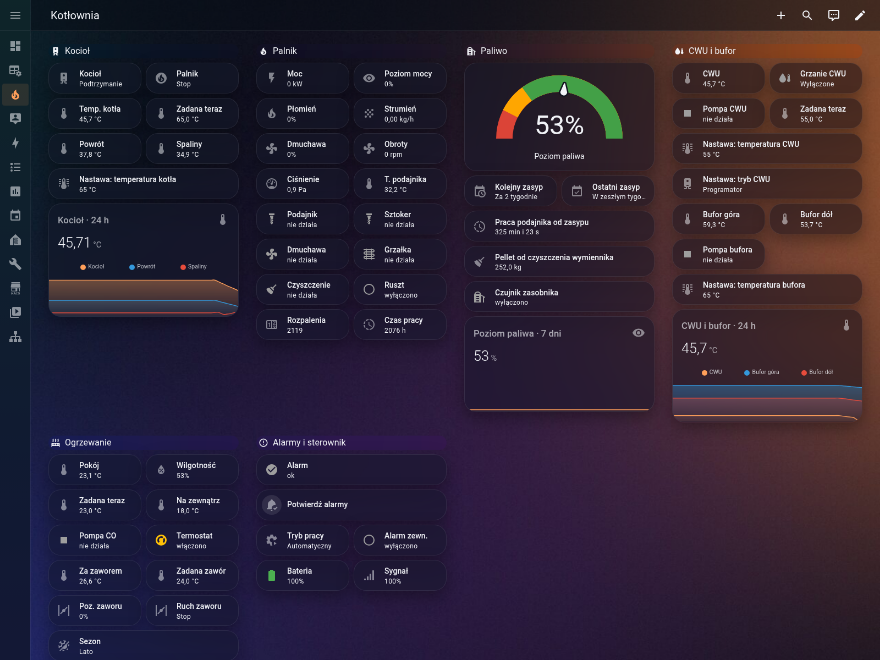
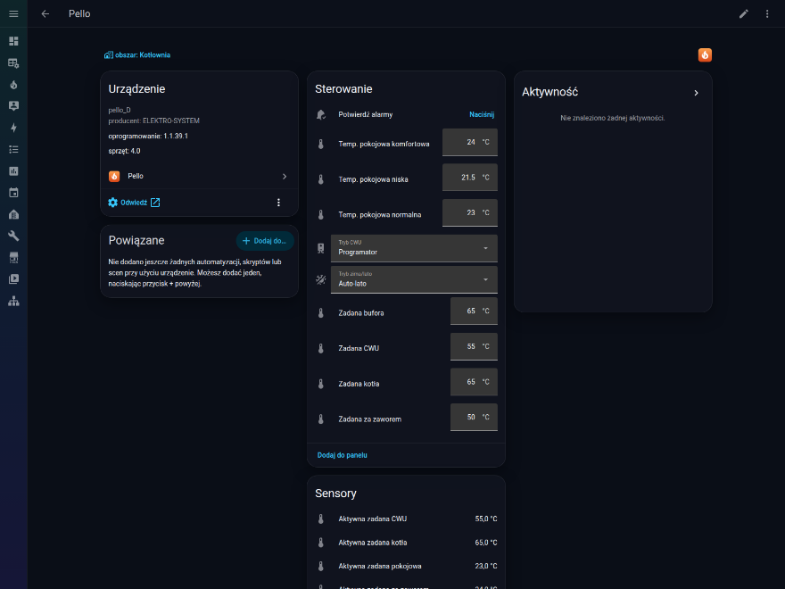

# Pello for Home Assistant

A local [Home Assistant](https://www.home-assistant.io/) integration for **Pello** pellet boiler
controllers made by ELEKTRO-SYSTEM (eSterownik.pl).

It reads everything the controller knows — temperatures, burner state, fuel level, pumps, alarms,
radio room sensors — and lets you change a short, reviewed list of settings. It talks directly to
the controller's own HTTP API on your network; the manufacturer's cloud is not involved.

> This is an unofficial project. It is not affiliated with or endorsed by ELEKTRO-SYSTEM.
> A boiler is a heating appliance: use the control features with care and at your own risk.

**Po polsku:** integracja Home Assistanta dla sterowników kotłów pelletowych Pello
(eSterownik.pl). Działa lokalnie, bez chmury. Odczytuje wszystkie rejestry sterownika i pozwala
zmieniać wybrane nastawy. Nazwy encji i stanów są przetłumaczone na polski.

## Screenshots

<p>
  <a href="docs/dashboard.png"></a>
  <a href="docs/device.png"></a>
</p>

Click a thumbnail for the full image. Left: an example dashboard, shown with a custom theme — its
configuration is in [`examples/dashboard.yaml`](examples/dashboard.yaml). Right: the device page
with the settings that can be changed and the sensors.

## Features

- One request per poll returns every register of the controller and its radio nodes.
- Entities are built from the controller's own register dictionary, so names, units, ranges and
  alarm messages come from the device, in English or Polish.
- About 100 entities enabled out of the box, with stable English entity ids.
- Every other register is available as a disabled sensor you can switch on when you need it.
- Setpoints and modes can be changed; everything that could harm the installation is read-only.
- One binary sensor per alarm, plus a summary sensor listing every active alarm.
- Reauthentication, reconfiguration (new address), diagnostics, read-only mode.

## Compatibility

Developed and tested against:

| Controller | Hardware | Firmware |
| --- | --- | --- |
| `pello_D` | 4.0 | 1.1.38, 1.1.39 |

Other Pello variants that serve `syncvalues.cgi` and `config/hardware.xml` will probably work,
because nothing about the register set is hard-coded except the curated list below. If you try
one, please open an issue and attach the integration's diagnostics.

Requires Home Assistant 2026.9 or newer.

## Installation

### HACS

1. HACS → menu → **Custom repositories** → add `https://github.com/mcflypl/ha-pello` as an
   *Integration*.
2. Install **Pello** and restart Home Assistant.

### Manual

Copy `custom_components/pello` into the `custom_components` directory of your Home Assistant
configuration and restart.

## Configuration

**Settings → Devices & services → Add integration → Pello**, then enter:

| Field | Meaning |
| --- | --- |
| Host | IP address or host name of the controller |
| Username, password | An account of the controller's local web panel |
| Name | Optional device name; defaults to the name set on the controller |

The account's access level decides what can be changed. An account that may not write a setting
still sees it, as a sensor.

Options (**Configure** on the integration):

| Option | Default | Meaning |
| --- | --- | --- |
| Polling interval | 30 s | 10–600 s |
| Read-only mode | off | Never write to the controller; settings become sensors, buttons disappear |

If the controller gets a new IP address, use **Reconfigure** — there is no need to remove it.

## Entities

Entity ids are English and start with the device name, for example
`sensor.pello_water_temperature`. Names follow the Home Assistant language.

### Enabled by default

| Group | Entities |
| --- | --- |
| Temperatures | water, return, hot water, outdoor, flue gas, mixing valve, buffer top and bottom, feeder, room |
| Active setpoints | boiler, hot water, mixing valve, room — after schedules and weather curves are applied |
| Boiler and burner | boiler status, burner status and detailed status, power (kW and %), flame, fuel flow, fan power and speed, pressure difference, feeding, power limit, ignition count, burner runtime |
| Fuel | level, next refuel, last refuel, feeder runtime since refuel, pellets burnt since exchanger cleaning |
| Modes | operating mode, season, hot water heating status, mixing valve action |
| Outputs | pumps, hot water pump, buffer pump, feeder, stoker, fan, igniter, burner and exchanger cleaning |
| Inputs | thermostats, grate position, hopper sensor, external alarm input |
| Alarms | one binary sensor per alarm register, and `alarm` which is on when any of them is |
| Radio nodes | temperature, humidity, battery and signal of each paired sensor, as separate devices |

Status sensors use stable states (`heating`, `ignition`, `auto_summer`, …) that are translated in
the UI, so automations do not depend on the language.

Alarm sensors carry the decoded conditions in the `messages` attribute; the summary sensor lists
all of them in `active`.

### Disabled by default

Every remaining register of the dictionary — hysteresis, PID, ignition and cleaning parameters,
calibration offsets and so on, about 160 of them — is created as a disabled, read-only sensor.
Its entity id uses the register name (`sensor.pello_kot_hist`) and its display name comes from
the controller.

### Not exposed

Credentials, network settings, weekly schedules, the controller clock, and registers of heating
circuits that are switched off.

## Changing settings

Only a reviewed list of registers can be changed, whatever access the controller itself would
grant to the account:

| Entity | Register |
| --- | --- |
| Setpoint (boiler) | `kot_tzad` |
| Hot water setpoint | `cwu_tzad` |
| Buffer setpoint | `tank_tzad` |
| Mixing valve setpoint | `ob1_tzad` |
| Room temperature low / normal / comfort | `ob1_pok_lo`, `ob1_pok_norm`, `ob1_pok_hi` |
| Season mode (winter, summer, auto summer) | `zima_lato` |
| Hot water mode (off, schedule, on, +1 h, +2 h) | `cwu_state` |
| Acknowledge alarms | `cmd_ackalarm` |
| Restart (disabled by default) | `cmd_reset` |

Values are limited to the range and step the controller declares.

The controller would also accept writes that force a pump, the feeder or the igniter, switch to
manual mode, change the boiler model or retune the burner. None of that is offered: a mistake
there can damage the installation. The list lives in `CURATED` in
[`catalog.py`](custom_components/pello/catalog.py) and a test pins it, so adding a control is
always a deliberate change.

The integration writes only when you change a number or a select or press a button. Setup and
polling never write.

### Example: notify about an alarm

```yaml
automation:
  - alias: Boiler alarm
    triggers:
      - trigger: state
        entity_id: binary_sensor.pello_alarm
        to: "on"
    actions:
      - action: notify.notify
        data:
          title: Boiler alarm
          message: "{{ state_attr('binary_sensor.pello_alarm', 'active') | join(', ') }}"
```

## How it works

| Endpoint | Use |
| --- | --- |
| `syncvalues.cgi` | All register values of all device slots in one response; polled |
| `config/hardware.xml` | The register dictionary: types, names, units, ranges, enum and alarm labels, access rights; read at setup |
| `info.cgi` | Model, versions, MAC address; read at setup |
| `setregister.cgi?device=<slot>&<register>=<value>` | Changes one register; called only on user action |

A firmware update that changes the dictionary reloads the integration, and new registers appear
as disabled sensors.

A radio node that stops reporting keeps its last value on the controller; its entities become
unavailable after 30 minutes of silence.

## Security and privacy

- Communication is plain HTTP with Basic authentication, because that is what the controller
  offers. Keep the controller on a network you trust.
- `syncvalues.cgi` also returns the controller's account registers. They are dropped while
  parsing and never reach entities, logs or diagnostics.
- Diagnostics redact the address, credentials, serial number, MAC and names, and leave out the
  weekly schedules.

## Troubleshooting

| Symptom | What to check |
| --- | --- |
| "Could not connect" during setup | The address, and that Home Assistant can reach the controller's network |
| "Wrong username or password" | Use an account of the local web panel, not the cloud account |
| A repair asks to sign in again | The password was changed on the controller |
| All entities unavailable | The controller is unreachable; they recover on their own |
| A setting shows up as a sensor | The account may not write it, or read-only mode is on |
| An entity you expect is missing | It may be disabled: device page → *disabled entities* |

For anything else, download diagnostics from the integration page and attach them to an issue.

## Development

Tests run in a container with the Home Assistant version pinned in `requirements_test.txt`:

```sh
scripts/test.sh                  # pytest with coverage
scripts/test.sh ruff check .
scripts/test.sh ruff format .
```

`tests/fixtures` holds responses recorded from a controller, with credentials, identifiers and
schedules replaced. `hardware.xml` there is the controller's register dictionary as served by the
device; it is included only so the tests exercise real data.

To support another setting, add it to `CURATED` in `catalog.py`, add its translations, and extend
`test_only_reviewed_registers_can_change_the_controller`.

### Releasing

1. Set the new version in `custom_components/pello/manifest.json`.
2. Move the entries under `Unreleased` in `CHANGELOG.md` to a section for that version.
3. Commit, then tag the commit `v<version>` and push the tag.

The release workflow checks that the tag matches the manifest, runs the tests and publishes a
GitHub release with the changelog section as its notes. HACS offers that release as an update.

## License

[Apache License 2.0](LICENSE).
